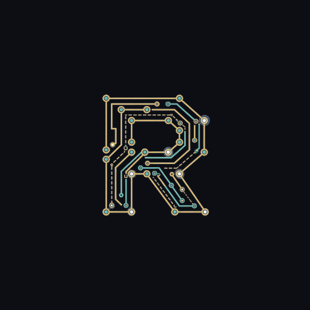
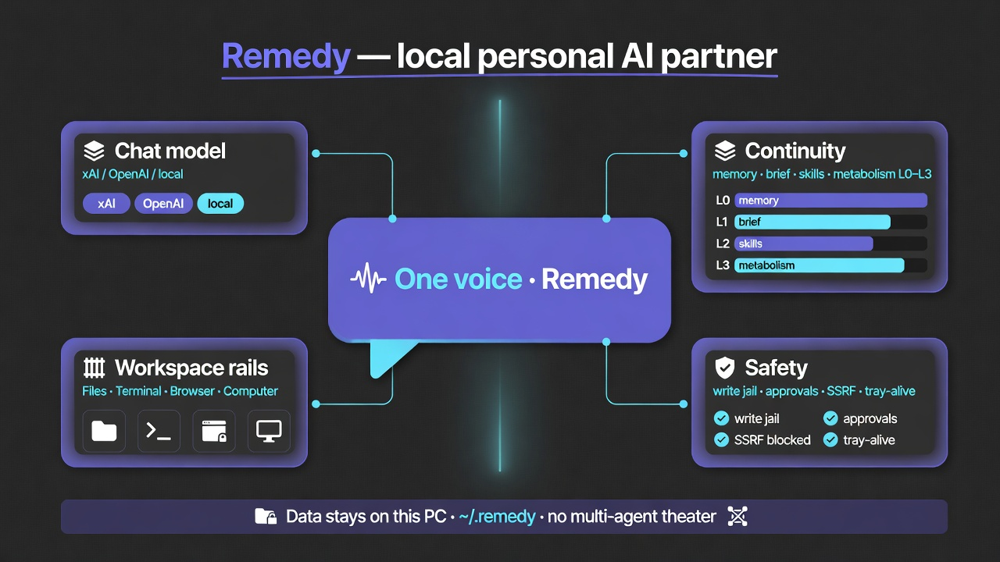

# Remedy

<p align="center">
  
</p>

<p align="center">
  <strong>Your personal AI partner — on your machine.</strong><br/>
  Knowledge · design · code · computer use · get-it-done.<br/>
  <em>One continuous partner</em> — not a thin chat wrapper, not a farm of bots.
</p>

<p align="center">
  <a href="https://github.com/AhmiDarrow/RemedyAI/releases/latest"><strong>Download for Windows</strong></a>
  ·
  <a href="docs/manual/00-overview.md">Owner’s manual</a>
  ·
  <a href="docs/manual/13-whats-new.md">What’s new</a>
  ·
  <code>pip install remedy-ai</code>
</p>

**Not** a medical product; the name means unsticking problems and finishing requests.  
**F1** opens the same Help wiki offline inside the app.

---

## About

<p align="center">
  
</p>

**Remedy** is a Windows-first desktop partner (Tauri + local FastAPI) that keeps **continuity on disk** under `~/.remedy` while **you** pick the chat model (xAI, OpenAI, Anthropic, Google, DeepSeek, Groq, Mistral, OpenRouter, Ollama, Custom).

| | |
|--|--|
| **Who it’s for** | Owners who want power without multi-agent theater — chat, files, shell, browser rail, computer use |
| **What stays local** | Memory, Session Brief, skills, approvals, DPAPI secrets, optional SmolVLM2 vision |
| **What you bring** | Your API keys / local Ollama — no Remedy cloud account for core use |
| **Current** | **v0.22.3** on [PyPI](https://pypi.org/project/remedy-ai/) · [GitHub Releases](https://github.com/AhmiDarrow/RemedyAI/releases) |

From the creator: *My name is Ahmi, I hope you enjoy my Remedy.*  
In-app: title-bar / tray → **About Remedy** · **Settings → About**.

---

## What’s new

**Latest: [v0.22.3](https://github.com/AhmiDarrow/RemedyAI/releases/tag/v0.22.3)** — Mid-turn failures leave a clear chat note; Sleev recovery stays direct.

<p align="center">
  
</p>

| Highlight | Why it matters |
|-----------|----------------|
| **L0–L3 turn tiers** | Instant local answers for “what model / skills / version”; full tools only when work needs them |
| **Agency that runs tools** | Review / implement keep tools on; false “activating skill” prose re-arms real function calls |
| **✕ → tray always** | Title-bar close hides to tray; local API stays warm. **Tray Quit** for full stop |
| **Write jail + security** | Project write roots, shell auth refuse, SSRF harden, Bearer computer host, opt-in **Privacy mode** |
| **Browser rail polish** | Video fullscreen stays **in-rail**; mobile/desktop site toggle; chat images with Bearer media; same-window OAuth |

**Also in 0.20–0.21:** evidence ledger, shadow rehearsal, Action IR, Time Crystal, skill genome, portable identity, multi-tab stream paint, messengers, signed Skills Library.

Full owner notes → **[docs/manual/13-whats-new.md](docs/manual/13-whats-new.md)** · engineering detail → **[CHANGELOG.md](CHANGELOG.md)**  
Earlier: [0.19.0 parallel multi-provider](docs/manual/13-whats-new.md#0190---parallel-multi-provider--background-turns) · [0.18.x](docs/manual/13-whats-new.md)

---

## Contents

1. [About](#about) · [What’s new](#whats-new)  
2. [What you get](#what-you-get) — product at a glance  
3. [Why it’s different](#why-its-different) — local continuity + metabolism  
4. [Workspace on your PC](#workspace-on-your-pc) — files, terminal, browser, computer  
5. [Local brain (SmolVLM2)](#local-brain-smolvlm2) — vision + efficiency without a second persona  
6. [Continuity workers](#continuity-workers) — silent nano swarm  
7. [Messengers](#messengers) — chat where you already are  
8. [Skills & Library](#skills--library)  
9. [Memory & long work](#memory--long-work)  
10. [Install](#install)  
11. [Security](#security)  
12. [Slash commands](#slash-commands)  
13. [Architecture](#architecture)  
14. [CLI & API](#cli--api)  
15. [Development](#development)  
16. [Support](#support) · [License](#license)  

### Owner’s manual (GitHub + F1)

| | |
|--|--|
| **Start here** | [Overview](docs/manual/00-overview.md) |
| **What’s new** | [13-whats-new](docs/manual/13-whats-new.md) |
| **All chapters** | [docs/manual/](docs/manual/) · [index](docs/manual/README.md) |
| **Continuity** | [How Remedy works](docs/manual/16-continuity-philosophy.md) |
| **Local SmolVLM2** | [Vision decoder](docs/manual/14-visual-decoder.md) |
| **Metabolism** | [Partner metabolism](docs/manual/19-metabolism.md) |
| **Security** | [Security & data](docs/manual/04-security-and-data.md) |

Also: [CHANGELOG.md](CHANGELOG.md) · [AGENTS.md](AGENTS.md)

---

## What you get

One desktop app. One local API. Your data under `~/.remedy`.

| | Capability |
|--|------------|
| **Chat partner** | Streaming markdown, Plan/Build, multi-provider parallel tabs, attachments, image markup |
| **Workspace** | **Files** · **Terminal** · **Browser** · **Scratch** · **Computer use** — rails beside chat |
| **Local brain** | **SmolVLM2 2.2B** on this PC — visual decoder + harness assist (optional download) |
| **Continuity** | Session Brief, partner memory, skills, context budget — silent workers, one voice |
| **Metabolism** | **0.22.0+** Soul Field + organism pulse, L0–L3 tiers, evidence, governor ([manual](docs/manual/19-metabolism.md)) |
| **Messengers** | Telegram, Discord, Slack, Mattermost, Matrix, WhatsApp, Teams, Google Chat, Signal (Settings) |
| **Skills** | Progressive disclosure · Installed \| Library · signed community catalog |
| **Memory** | Durable facts · Progress snapshots · plans — calm UI, not scare-logs |
| **Agency** | `file_edit`, repo search, shell write jail, missions, `spread_run`, `web_search` / `web_fetch`, approvals |
| **Always ready** | **0.20.0+** title-bar **✕ → tray** (API stays up); **tray Quit** for full stop |
| **Web UI** | Same SPA at `http://127.0.0.1:7400/` (Switch to WebUI → tray) |
| **Updates** | Minisign-signed auto-update from GitHub Releases |

Your **chat model** is yours: xAI, OpenAI, Anthropic, Google, DeepSeek, Groq, Mistral, OpenRouter, **Ollama**, or Custom. Continuity and local SmolVLM2 live **on disk**, not in a Remedy cloud.

---

## Why it’s different

```text
You  →  Continuity (brief · memory · skills · budget · local SmolVLM2)  →  Your model  →  Tools
              ↑________________ learn / compress / remember ________________|
```

| You feel | What’s actually happening |
|----------|---------------------------|
| **Fast** | Hot path stays cheap; heavy work is background |
| **Cheaper** | Less tool sludge re-sent; local SmolVLM2 where it saves paid calls |
| **Same partner** | Switch providers anytime — identity is local |

Deep dive: [Continuity philosophy](docs/manual/16-continuity-philosophy.md) · In-app **F1**.

---

## Workspace on your PC

Remedy is a **workbench**, not only a chat box. Icon rails open real tools next to the conversation:

| Tool | What it is |
|------|------------|
| **Files** | Project / session file browser — open, copy path, drag into chat |
| **Terminal** | In-app **PowerShell** (ConPTY) — same machine the agent can work on |
| **Browser** | Embedded **WebView2** (Chromium) research pane; **↗** opens system browser when you need full Chrome |
| **Scratch** | Quick notes pad bound to the session |

Left · chat · right layout; popout / fullscreen for Terminal, Browser, Scratch.  
Manual: [Chat & sessions](docs/manual/05-chat-and-sessions.md) · [Desktop notes](docs/DESKTOP.md)

---

## Local brain (SmolVLM2)

**On-device efficiency** — not a second chatbot.

| Job | Local **SmolVLM2 2.2B** |
|-----|-------------------------|
| **Visual decoder** | Images → structured text briefs so **any** chat model can reason about screenshots |
| **Prefer-local vision** | Decode here first; save provider vision tokens when you want |
| **Harness assist** | Session Brief can refresh in the background without another paid API call |
| **Continuity assist** | Optional nano refine when the server is already up (never blocks the hot path) |

**How it ships:** not in the installer → one first-run download → `~/.remedy/vision/` → **llama-server** on **127.0.0.1** → auto-starts with Remedy. CPU by default; CUDA when NVIDIA is available.

Manual: [Local vision & on-device SmolVLM2](docs/manual/14-visual-decoder.md)

---

## Continuity workers

Silent local workers (sometimes called the **nano swarm** in code). They measure, prune, rank, and distill. They **do not** take the microphone.

| Worker | Job |
|--------|-----|
| Token | Context fill, compress nudge, usage calibration |
| Router | Intent → policy (memory / skill / plan / tool / chat) |
| Memory | Session Brief touch |
| Pattern | Tool sequences, stuck signals, learn pre-gate |
| Skill | Ranking and feedback for procedures |

Heuristics first; local SmolVLM2 only when already running and useful.  
Operators: [Continuity workers](docs/manual/17-nanoswarm.md) · `/harness`

---

## Messengers

Talk to Remedy where you already chat. Sessions show up in the desktop list (e.g. `TG · …`) with shared history.

| Platform | Status (catalog) |
|----------|------------------|
| **Telegram** | Ready — long-poll bot (allowlist recommended) |
| **Discord · Slack · Mattermost · Matrix** | Ready adapters |
| **WhatsApp · Teams · Google Chat · Signal** | Partial (webhooks / signal-cli / setup-dependent) |

Configure under **Settings → Messengers**. Empty allowlist = ignore inbound (unless you allow all).  
Security defaults stay local-first: no public doorway by accident.

---

## Skills & Library

| Path | Meaning |
|------|---------|
| **Learn from work** | Multi-step success → probation skills → promote over sessions |
| **Installed** | Bundled + learned + trusted library packs on this machine |
| **Library** | Signed community catalog ([remedy-skills](https://github.com/AhmiDarrow/remedy-skills)) — install → quarantine → **Trust** |

Format: [agentskills.io](https://agentskills.io) · Lifecycle: [SKILL_LIFECYCLE.md](docs/SKILL_LIFECYCLE.md) · Manual: [Skills](docs/manual/07-skills.md)

---

## Memory & long work

- **Durable memory** — SQLite + FTS5, profile, handoffs  
- **Memory Harness** — lean *send-view* for the model; full transcript kept  
- **Progress** — mid-task snapshots (calm wording: progress, not “the app crashed”)  
- **Plans** — Plan mode outlines; Build executes with approvals  
- **Time travel** — restore chat (+ best-effort files) to an earlier step  

`/compact` · `/harness` · [Memory manual](docs/manual/06-memory-and-harness.md)

---

## Install

1. [Download the **latest** Windows installer](https://github.com/AhmiDarrow/RemedyAI/releases/latest)  
2. Run Setup → provider + optional workspace + optional local vision  
3. **F1** Help · `/help` commands  

> **SmartScreen?** Solo builds are not Authenticode-signed yet — **More info → Run anyway**. Install only from this repo’s Releases. Updates are **minisign**-verified. Autostart = Startup folder (not registry Run).

Local API: **127.0.0.1:7400** (sidecar).

---

## Security

**Maximum capability for you. No accidental LAN doorway.**

| Layer | Default |
|-------|---------|
| API | Loopback + Bearer token |
| CORS | No wildcard while auth is on |
| Secrets | `~/.remedy/auth/` (DPAPI on Windows when available) |
| Scope | Project / home / full machine (opt-in) |
| Approvals | **Ask** default |
| Skills | Quarantine until Trust |
| Messengers | Allowlist-first |

No Remedy cloud account for core use. Chat goes to **your** provider (or local Ollama).  
[Security & data](docs/manual/04-security-and-data.md)

---

## Slash commands

| | |
|--|--|
| `/help` · `/new` · `/reset` · `/clear` · `/sessions` · `/models` · `/thinking` | Session & UI |
| `/memory` · `/remember` · `/forget` · `/pin` · `/whoami` | Memory |
| `/goals` · `/goal` · `/plans` · `/plan` … | Plans |
| `/compact` · `/harness` | Harness |
| `/approve` · `/deny` | Approvals |
| `/export` · `/import` · `/import-session` | I/O |
| `/skills` · `/handoff` · `/security-status` · `/init` · `/helper` · `/tip` | Skills & tips |

Full list: [Commands](docs/manual/11-reference-commands.md)

---

## Architecture

<p align="center">
  
</p>

```text
┌─ Desktop (Tauri 2) ─────────────────────────────────────┐
│  React SPA · tray · updates · Files/Terminal/Browser   │
│              │                                           │
│  remedy serve · FastAPI :7400                            │
│    gateway · core · memory · skills · vision (SmolVLM2)  │
└──────────────────────────────────────────────────────────┘
     CLI · WebUI · Telegram · Discord · Slack · …
```

---

## CLI & API

```bash
# Package name on PyPI is remedy-ai
pip install remedy-ai

remedy chat
remedy serve --host 127.0.0.1 --port 7400 --skip-setup
# Web UI http://127.0.0.1:7400/  ·  /docs  ·  /dashboard
```

WebUI is the **same SPA** as desktop (`desktop/dist`). After UI changes:  
`cd desktop && npm run build`, then restart serve if needed — see [AGENTS.md](AGENTS.md) (*Desktop SPA vs WebUI*).

---

## Development

```bash
git clone https://github.com/AhmiDarrow/RemedyAI.git && cd RemedyAI
uv sync --group dev
uv run pytest -q          # 560+ tests; currently ~1755
cd desktop && npm test && npm run build
python scripts/check_docs.py
cd desktop && npm run tauri:dev   # full shell (set REMEDY_DEV_ROOT to repo)
```

Release: `python scripts/sync_version.py X.Y.Z` · `python scripts/sync_help_manual.py` · `python scripts/check_docs.py` · tag `vX.Y.Z` · GitHub Actions.  
Signing: [AGENTS.md](AGENTS.md) · [WINDOWS_SIGNING.md](docs/WINDOWS_SIGNING.md)

---

## Support

[patreon.com/cw/AhmiDarrow](https://www.patreon.com/cw/AhmiDarrow) — thank you.

---

## License

**Source-available** — [LICENSE](./LICENSE) · [COMMERCIAL.md](./COMMERCIAL.md)

| Who | Terms |
|-----|--------|
| Solo / small indies (&lt; $1M revenue **and** &lt; 20 FTE) | Free under LICENSE |
| Personal / education / research | Free |
| Larger orgs, SaaS, commercial resale | Written license — **ahmitdarrow@gmail.com** |

Copyright © 2025–2026 **Ahmi Darrow**.

---

*My name is Ahmi, I hope you enjoy my Remedy.*
