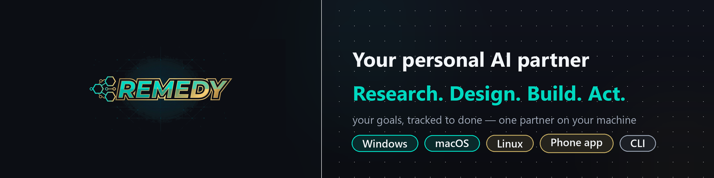
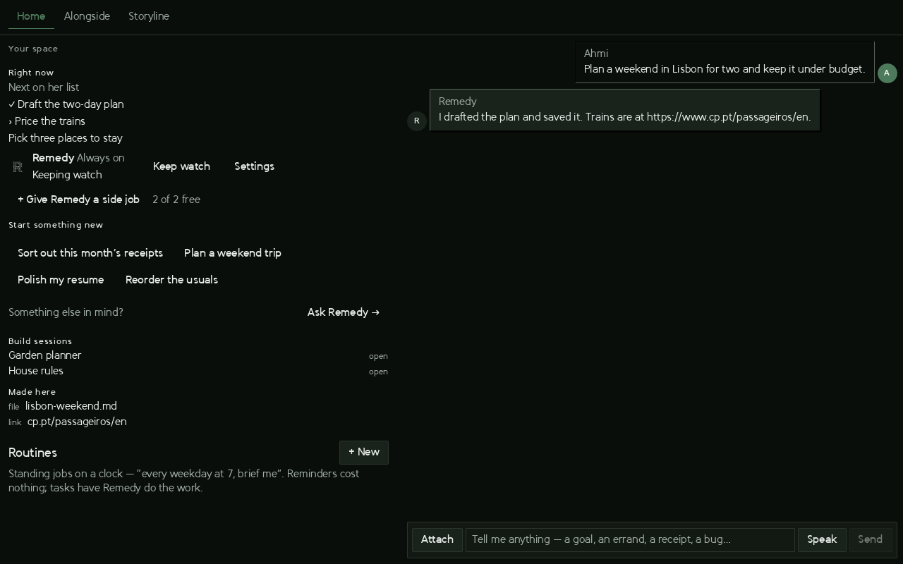
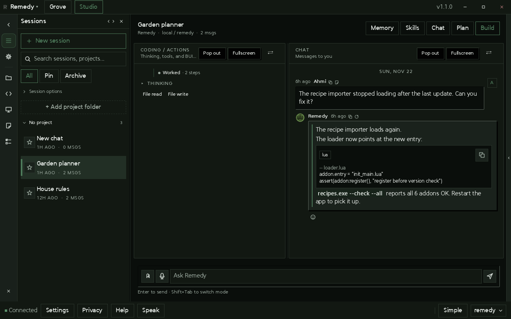
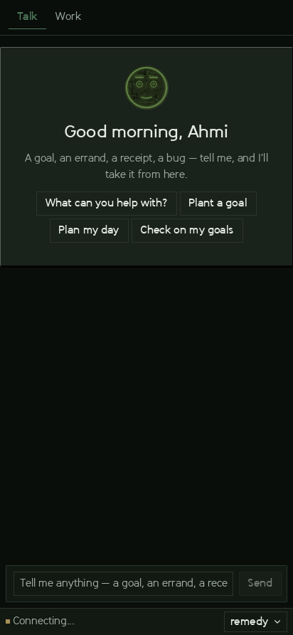
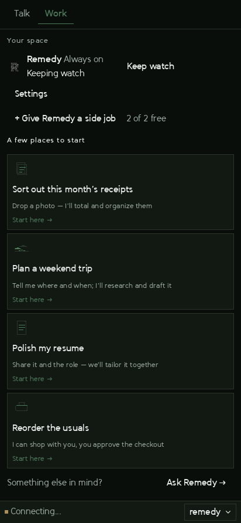
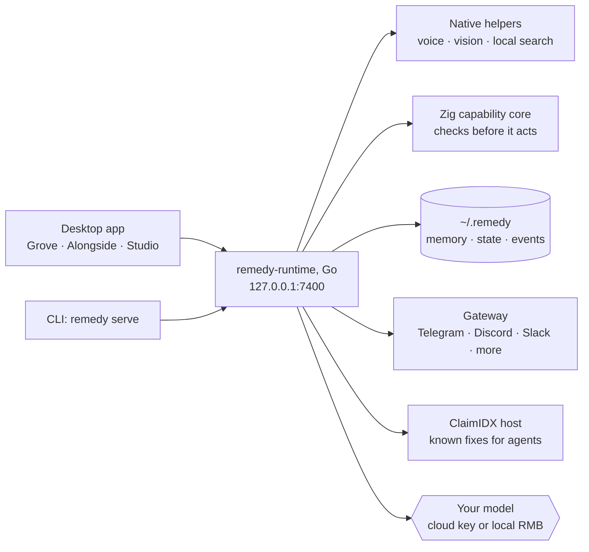

# Remedy

<p align="center">
  
</p>

<p align="center">
  <em>A partner for any ability level</em> — she drives this computer to finish the goal you set.
</p>

<p align="center">
  <a href="https://github.com/AhmiDarrow/RemedyAI/releases/latest"><strong>Download for Windows</strong></a>
  ·
  <a href="https://github.com/AhmiDarrow/RemedyAI/releases/latest">Download for macOS</a>
  ·
  <a href="https://github.com/AhmiDarrow/RemedyAI/blob/master/docs/manual/01-install-linux.md">Install on Linux</a>
  ·
  <a href="https://github.com/AhmiDarrow/RemedyAI/blob/master/docs/manual/00-overview.md">Owner’s manual</a>
  ·
  <a href="https://github.com/AhmiDarrow/RemedyAI/blob/master/docs/manual/13-whats-new.md">What’s new</a>
  ·
  <a href="https://github.com/AhmiDarrow/RemedyAI/releases/latest">Download</a>
</p>

**Not** a medical product. **F1** (or **Ctrl+/**) opens the same Help wiki inside the app.

---

Remedy lives on **this computer**. The Desktop app runs on **Windows x64**, **Linux** (including WSLg), and **macOS** (Apple Silicon and Intel). The CLI also runs on **Windows ARM64** and **Linux ARM64**. **Grove** is home. **Studio** is the workbench. Continuity is `~/.remedy`. You bring the model (cloud keys or **RMB** locally). Money, passwords, submit, send, and delete **stop for you**.

| | |
|--|--|
| **Latest release** | [](https://github.com/AhmiDarrow/RemedyAI/releases/latest) |
| **Source on `master`** | [](https://github.com/AhmiDarrow/RemedyAI/blob/master/CHANGELOG.md) · [What’s new](https://github.com/AhmiDarrow/RemedyAI/blob/master/docs/manual/13-whats-new.md) |
| **Owner’s manual** | [docs/manual/](https://github.com/AhmiDarrow/RemedyAI/tree/master/docs/manual/) · [index](https://github.com/AhmiDarrow/RemedyAI/blob/master/docs/manual/README.md) |
| **Install** | [Windows](https://github.com/AhmiDarrow/RemedyAI/blob/master/docs/manual/01-install-windows.md) · [Linux](https://github.com/AhmiDarrow/RemedyAI/blob/master/docs/manual/01-install-linux.md) · macOS Desktop from [Releases](https://github.com/AhmiDarrow/RemedyAI/releases/latest) · no desktop: `scripts/install.sh` / `scripts/install.ps1` |
| **Security / data** | [04-security-and-data](https://github.com/AhmiDarrow/RemedyAI/blob/master/docs/manual/04-security-and-data.md) |
| **Commands / keys** | [11-reference-commands](https://github.com/AhmiDarrow/RemedyAI/blob/master/docs/manual/11-reference-commands.md) · [12-reference-shortcuts](https://github.com/AhmiDarrow/RemedyAI/blob/master/docs/manual/12-reference-shortcuts.md) |
| **Changelog** | [CHANGELOG.md](https://github.com/AhmiDarrow/RemedyAI/blob/master/CHANGELOG.md) |

Local API: `127.0.0.1:7400`. Close ✕ hides to the **tray** on Windows, the **menu bar** on macOS, and **minimizes** on Linux/WSLg. On a machine without a desktop, the install script downloads a checksum-verified `remedy-runtime` and `remedy_core` for this OS from GitHub Releases.

Reasoning effort, thinking budget, max output tokens, and context window can be set for all models or per model (Settings → **Reasoning and context**, `remedy settings set reasoning_effort=high`, or `config.toml`). Unset keeps each provider's default. See [Reasoning effort and context](https://github.com/AhmiDarrow/RemedyAI/blob/master/docs/USAGE.md#reasoning-effort-and-context).

From the creator: *My name is Ahmi, I hope you enjoy my Remedy.*

---

## Screenshots

Sample data throughout.

| Grove, the home screen | Studio, for building |
|---|---|
|  |  |

| Phone: talk | Phone: work |
|---|---|
|  |  |

## How it fits together


```mermaid
flowchart LR
  desk[Desktop app<br/>Grove · Alongside · Studio] --> rt
  cli["CLI: remedy serve"] --> rt
  rt[remedy-runtime, Go<br/>127.0.0.1:7400] --> helpers[Native helpers<br/>voice · vision · local search]
  rt --> zig[Zig capability core<br/>checks before it acts]
  rt --> home[(~/.remedy<br/>memory · state · events)]
  rt --> gw[Gateway<br/>Telegram · Discord · Slack · more]
  rt --> claim[ClaimIDX host<br/>known fixes for agents]
  rt --> model{{Your model<br/>cloud key or local RMB}}
```

Details: [docs/ARCHITECTURE.md](https://github.com/AhmiDarrow/RemedyAI/blob/master/docs/ARCHITECTURE.md).

## Supported platforms

These are the platforms with published assets on the [latest GitHub release](https://github.com/AhmiDarrow/RemedyAI/releases/latest). The table lists only triples that shipped and whose checksums were verified against `remedy-native-SHA256SUMS.txt`. From 0.69.0 the main release lists only the Desktop installers and `latest.json`. The CLI runtime files, macOS updater tarballs, and signatures are on a `runtime-v<version>` companion prerelease, which the install script downloads from.

| Platform | Desktop app | Install script (no desktop) |
|----------|-------------|-----------------------------|
| Windows x64 | Yes — `Remedy.Desktop_*_x64-setup.exe` | Yes |
| Windows ARM64 | — | Yes |
| Linux x86_64 | Yes — AppImage and `.deb` | Yes |
| Linux arm64 | — | Yes |
| macOS arm64 (Apple Silicon) | Yes — unsigned `Remedy.Desktop_*_aarch64.dmg` | Yes |
| macOS x86_64 (Intel) | Yes — unsigned `Remedy.Desktop_*_x64.dmg` | Yes |

There is no Windows ARM64 Desktop installer in this release. macOS builds are ad-hoc signed and not notarized.

### Install

**Windows x64 (Desktop).** Download [`Remedy.Desktop_*_x64-setup.exe`](https://github.com/AhmiDarrow/RemedyAI/releases/latest), run the installer, and launch from the Start Menu or the desktop shortcut. Details: [Install on Windows](https://github.com/AhmiDarrow/RemedyAI/blob/master/docs/manual/01-install-windows.md).

**Linux x86_64 (Desktop).** From the same [Releases](https://github.com/AhmiDarrow/RemedyAI/releases/latest) page:

- **`.deb`** (Debian/Ubuntu): `sudo apt install ./Remedy.Desktop_*_amd64.deb`
- **AppImage:** `chmod +x Remedy.Desktop_*.AppImage && ./Remedy.Desktop_*.AppImage`

Details: [Install on Linux](https://github.com/AhmiDarrow/RemedyAI/blob/master/docs/manual/01-install-linux.md).

**macOS (Desktop, Apple Silicon and Intel).** From the same [Releases](https://github.com/AhmiDarrow/RemedyAI/releases/latest) page, download `Remedy.Desktop_*_aarch64.dmg` (Apple Silicon) or `Remedy.Desktop_*_x64.dmg` (Intel). Open the disk image and drag Remedy Desktop to Applications. This build is unsigned (ad-hoc codesign, no Apple notarization). First launch: right-click the app and choose Open, or clear quarantine:

```bash
xattr -dr com.apple.quarantine "/Applications/Remedy Desktop.app"
```

In-app updates use the minisign-signed `.app.tar.gz` from the same release.

**CLI on Windows (x64 and ARM64), Linux (x86_64 and arm64), and macOS (arm64 and x86_64):**

```bash
sh scripts/install.sh        # Linux, macOS
.\scripts\install.ps1      # Windows (PowerShell)
remedy serve
```

The script downloads the checksum-verified `remedy-runtime` / `remedy_core` pair for this OS from the `runtime-v<version>` GitHub release (verified against `remedy-native-SHA256SUMS.txt`), installs it for the current user, and adds the `remedy` command. Then open `http://127.0.0.1:7400`. No Go or Zig toolchain is required. HQ voice reference clips download into `~/.remedy/voice/references/` on first use. Run the script again to update.

---

## Development

```bash
git clone https://github.com/AhmiDarrow/RemedyAI.git && cd RemedyAI
cd native/go && go test -race ./... && go vet ./...     # Go runtime
cd ../zig && zig build test -Doptimize=ReleaseSafe      # Zig core
cd ../../desktop/remedyui && cargo test                 # desktop app (RemedyUI)
cd ../../connect/app && cargo test                      # phone app
cargo remedy package --target android                   # build the phone app APK
```

Before a push, run the local gate: `uv run python scripts/prepush.py`
(enable the hook once per clone with `git config core.hooksPath .githooks`).
The gate runs the checks above for the parts of the tree you changed.
CI has three workflows in `.github/workflows`: the desktop release, the
RemedyUI desktop package, and the release-asset check.

Version / help / docs / sanitize gates: `scripts/sync_version.py` · `scripts/sync_help_manual.py` · `scripts/check_docs.py` · `scripts/check_sanitize.py`.  
Contributing: [CONTRIBUTING.md](https://github.com/AhmiDarrow/RemedyAI/blob/master/CONTRIBUTING.md) · signing: [WINDOWS_SIGNING.md](https://github.com/AhmiDarrow/RemedyAI/blob/master/docs/WINDOWS_SIGNING.md)

---

## Support

[patreon.com/cw/AhmiDarrow](https://www.patreon.com/cw/AhmiDarrow)

## License

**Apache License 2.0** — [LICENSE](https://github.com/AhmiDarrow/RemedyAI/blob/master/LICENSE) · [NOTICE](https://github.com/AhmiDarrow/RemedyAI/blob/master/NOTICE)

Free to use, modify, and redistribute, including commercially. Use is at your own risk; see [TERMS](https://github.com/AhmiDarrow/RemedyAI/blob/master/docs/TERMS.md). Third-party notices: `desktop/public/THIRD_PARTY_NOTICES.txt`.

Copyright © 2025–2026 **Ahmi Darrow**.

"Hope this helps" - Ahmi
